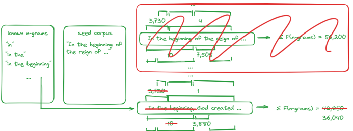

# Bible N-Gram Analysis

This project is intended as a collection of various methods to collect an optimized seed corpus. 

## ScriptureReference.py

This class provides the Bible verses for any other script to acquire verses as a list within a given range. The verses are outputted as a 2D list of `[verse_reference, verse_text]` pairs.  
The class constructor also has an argument for translation (from ebible corpus). Capability for different versifications upcoming (currently not standard).

## n_gram_approach.py

This script performs the n-gram analysis. Generally, it finds the verses containing n-grams which are most frequently distributed throughout the corpus. Verses are in order of how frequent and undiscovered its n-grams are. All n-gram frequency scores added to and removed from verses are normalized for verse length.

The resulting seed corpus should contain verses with n-grams which are very common in the Bible, and the seed corpus verses should also be very different from one another.  
The script also provides a visualization of the scores and time taken for each seed.  
  
There are four variables that you can adjust in this script:  
  
- **j**: This is the n-gram order. N-grams up to n=J are scored by frequency count.
- **seed_size**: This is the size of the seed corpus. It determines the number of verses that will be included in the seed corpus.
- **start_verse**: This is the starting verse for the range of verses to be analyzed.
- **end_verse**: This is the ending verse for the range of verses to be analyzed.

